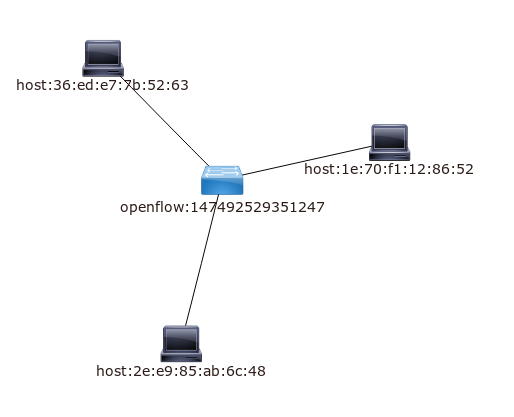

Sample using Open vSwitch,  OpenDayLight and Docker
======================================================

.. _network_1:

Our networks topology is as :numref:`network_1`
Each node is an instance of Docker.

Detail
-------

Create nodes, bind them to virtual bridge which was created using OpenVSwitch

.. code-block:: html

    ######### create nodes using openvswitch ##########

    BR="ovs-br0"

    sudo ovs-vsctl add-br $BR
    sudo ifconfig $BR 173.16.1.1 netmask 255.255.255.0 up

    docker run -dit --net=none --name debian_1 dev/debian
    docker run -dit --net=none --name debian_2 dev/debian
    docker run -dit --net=none --name debian_3 dev/debian

    sudo pipework $BR debian_1 173.16.1.2/24
    sudo pipework $BR debian_2 173.16.1.3/24
    sudo pipework $BR debian_3 173.16.1.4/24

    # Controller will be ovs-br0 tcp:173.16.12.1:6633”
    ovs-vsctl set-controller $BR tcp:127.0.0.1:6653

Add features to karaf

.. code-block:: html

    # start karaf
    ./distribution-karaf-0.3.0-Lithium/bin/karaf

    # add feature
    # feature:install odl-dlux-all odl-restconf-all odl-l2switch-switch

    # restart karaf
    shutdown -f

    # start karaf again
    # display the log using log:tail
    # wait ultill log:tail does not refresh
    # took around  5 minutes

    # clean features using
    # bin/karaf clean

# from node X ping 2 others nodes so topology's flow is visible

.. code-block:: html

    docker exec debian_1 ping -c2 173.16.1.3
    docker exec debian_1 ping -c2 173.16.1.4

    docker exec debian_2 ping -c2 173.16.1.2
    docker exec debian_2 ping -c2 173.16.1.4

    docker exec debian_3 ping -c2 173.16.1.2
    docker exec debian_3 ping -c2 173.16.1.3

